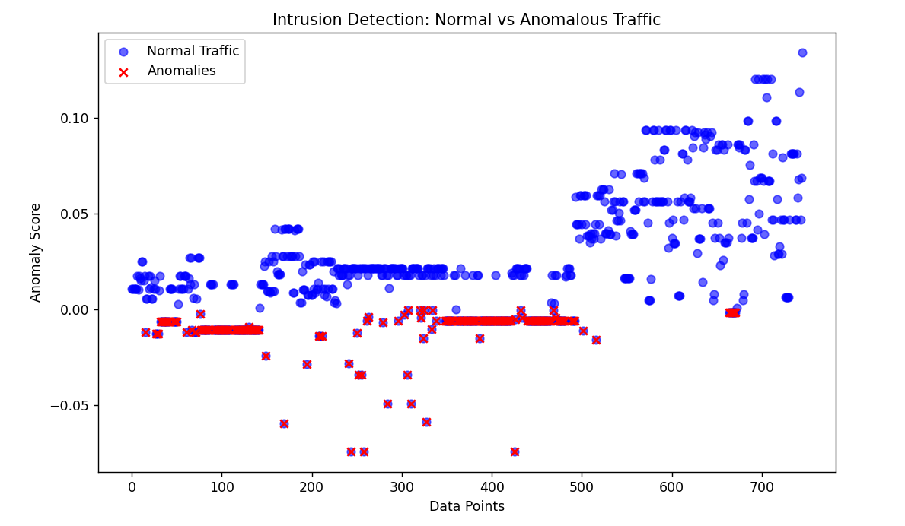
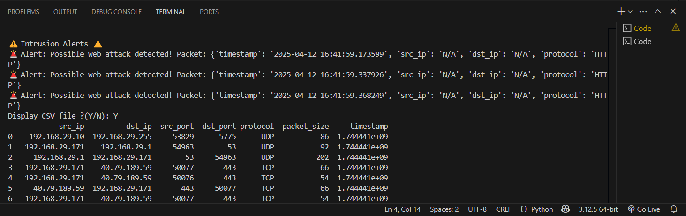

#  Hybrid Intrusion Detection System (HIDS)

A real-time **Hybrid Intrusion Detection System** that combines **signature-based detection** with **machine learning-based anomaly detection** to monitor and flag malicious network activity.

This system captures live network traffic, processes it into structured data, and performs multi-phase detection to identify both known and unknown threats.

---

## Overview

Modern networks face constantly evolving threats where traditional signature-based detection alone is insufficient. This project demonstrates a hybrid IDS approach by integrating rule-based detection with unsupervised machine learning to improve visibility into both known and unknown attack patterns.

The system generates a fresh dataset for each network environment, providing a closer-to-real-world representation of how intrusion detection operates in production systems.

---

##  Key Features

-  **Signature-based detection** for known malicious patterns  
-  **Machine learning–based** anomaly detection using `Isolation Forest`  
-  **Real-time** packet capture and analysis  
-  **Automated feature extraction** from raw network traffic  
-  Visualization of anomalous vs normal traffic  
-  **Modular architecture** for flexibility and extension  

---

##  How It Works

1. **Capture Traffic**  
   Live network traffic is captured using `Scapy` and saved for further analysis in `.pcap` format.

2. **Extract & Process Features**  
   Captured packets are processed using `PyShark` to extract protocol-level and statistical features, which are converted into structured `CSV` data.

3. **Signature-Based Detection**  
   Compares against known malicious patterns like:
   - IP: `192.168.1.100` → Internal attacker
   - Protocol: `HTTP` → Potential web attack

4. **Behavior-Based Anomaly-Based Detection**  
   Trained `IsolationForest` model flags statistically unusual traffic (no labels needed)

5. **Visualization and Alerts**  
   Detected anomalies are visualized, and alerts are generated for suspicious traffic.

---

## Project Structure

```text
Hybrid-Intrusion-Detection-System/
│
├── Analysis/
│   └── pyshark_analysis.py
│       # Processes captured traffic using PyShark for protocol-level analysis
│
├── Capture/
│   └── scapy_capture.py
│       # Captures live network packets using Scapy
│
├── Captured_Data/
│   └── tabular.py
│       # Displays captured, preprocessed, and filtered traffic stored in CSV format
│
├── Detection/
│   ├── behaviour_based.py
│   │   # Machine learning–based anomaly detection
│   └── signature_based.py
│       # Signature-based intrusion detection
│
├── Models/
│   └── anomaly_detector.pkl
│       # Trained Isolation Forest model
│
├── main.py
│   # Runs the complete detection pipeline
│
├── Train_model.py
│   # Trains or updates the anomaly detection model
│
├── Visualise_anomalies.py
│   # Generates visual plots for detected anomalies
```
---

## Tech Stack

- **Python** — Core programming language  
- **Scapy** — Real-time packet capture and manipulation  
- **PyShark** — Deep packet inspection and protocol analysis  
- **Scikit-learn** — Machine learning (`Isolation Forest` for anomaly detection)  
- **Pandas** — Data preprocessing and feature engineering  
- **Matplotlib** — Anomaly visualization and traffic analysis plots

---

##  How to Run

###  Install Requirements

```bash
pip install pandas scikit-learn joblib pyshark scapy matplotlib
```

---

###  Run the Full Detection Pipeline

```bash
python main.py
```

This will:
- Capture traffic
- Analyze packets
- Run both detection techniques
- Ask if you want to visualize anomalies

---

###  Train/Update the ML Model

```bash
python Train_model.py
```

- Trains `IsolationForest` on processed network data
- Automatically saves the model as `models/anomaly_detector.pkl`

---

##  Visual Output

###  Anomaly Detection Preview



---

###  Real-Time Detection Output


---

###  Signature-Based Alerts



---

## Use Cases

- Network intrusion detection  
- SOC traffic monitoring  
- Behavioral anomaly detection  
- Cybersecurity research and experimentation  

---

## Future Enhancements

- MITRE ATT&CK technique mapping  
- SIEM integration  
- Real-time dashboard and alerting  
- Advanced ML/DL models for traffic classification  

---

## Disclaimer

This project is intended for **educational and research purposes only**.  
Do **not** deploy in production environments without proper security review, testing, and validation.

---
